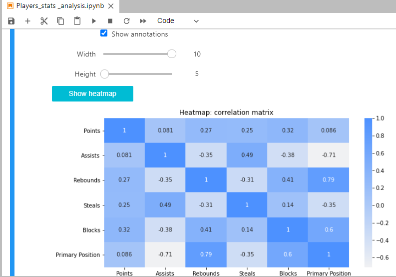
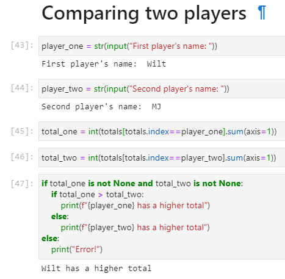
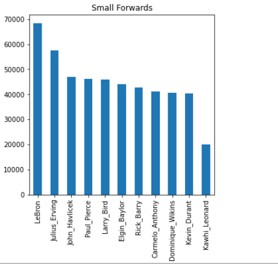

# NBA-Players-Stats-analysis 
A quick interactive Notebook to visualize some NBA players stats (points, assists, steals, blocks...) and totals, rankings and comparisons. Feel free to add any players in the .csv data files. :basketball:

## Features

### Heatmaps:

### Players comparison:

> **Before comparing two players, make sure to run all the cells.**

### Totals by position:

## How to use 

### 1-Navigate to the desired section (ex: -> Heatmap)

> **For convenience purposes, all the sections are designed this way.**

### 2-Interact with controls/widgets: 

## Prerequisites

- Language: Python 3.x or higher
- IDE: Jupyter Lab and Jupyter Lab widgets installed.
- Libraries: Pandas, Matplotlib, NumPy, Seaborn, IPywidgets, IPython
